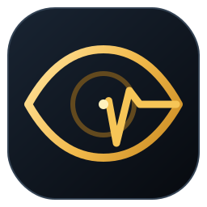
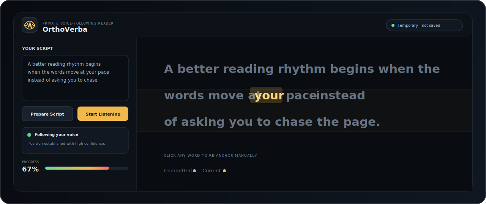
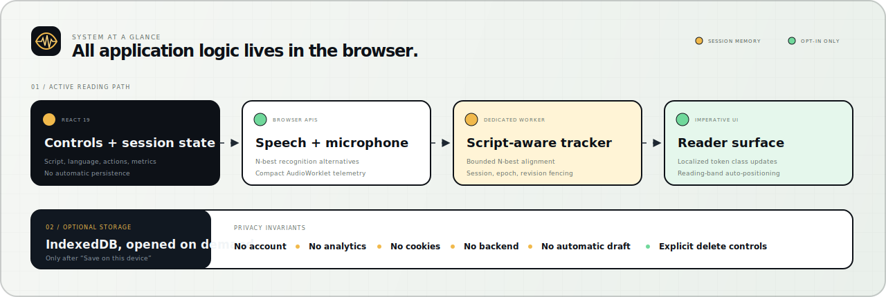

<p align="center">
  
</p>

<p align="center">
  
</p>

<h1 align="center">OrthoVerba</h1>

<p align="center">
  <strong>A private reader that follows your voice.</strong><br />
  Paste a known script, read naturally, and keep your place without chasing a fixed-speed teleprompter.
</p>

<p align="center">
  <a href="https://github.com/GrimNej/OrthoVerba/actions/workflows/ci.yml"></a>
  
  
  
  
  <a href="LICENSE"></a>
</p>

<p align="center">
  <a href="https://orthoverba.grimnej.com"><strong>Open the live demo</strong></a> ·
  <a href="#60-second-demo">60-second demo</a> ·
  <a href="#how-it-works">How it works</a> ·
  <a href="#privacy-by-default">Privacy</a> ·
  <a href="#development">Development</a>
</p>

---

## The idea

Reading aloud creates a surprisingly awkward problem: glance away for a moment and every line looks the same when you return. Fixed-speed teleprompters solve scrolling, but they make the reader follow a timer.

**OrthoVerba reverses that relationship.** It listens for alternatives produced by the browser, aligns them against the script you already provided, and advances a calm reading surface at your pace. A skip, correction, or recognition restart does not have to send the cursor racing through the document; the tracker moves through provisional, stable, and committed positions before updating the page.

It is useful for presenters, voice-over artists, content creators, students, language learners, and readers who benefit from a strong visual anchor.

<p align="center">
  
</p>

## 60-second demo

For voice tracking, open the [live demo](https://orthoverba.grimnej.com) in a current version of Chrome or Edge.

1. Keep the example script or paste your own.
2. Select a language and press **Prepare Script**.
3. Press **Start Listening** and allow microphone access.
4. Read naturally. Watch the current phrase move through the reading band.
5. Click any word, or use **Previous** / **Next**, to re-anchor manually.

No account or API key is required. If voice recognition is unavailable, the editor, prepared reader, manual navigation, and optional local saving still work.

## What changed in V2

OrthoVerba V2 keeps the original project's eye-and-wave identity and rebuilds the product around stronger tracking, privacy, and failure boundaries.

| Original prototype | OrthoVerba V2 |
| --- | --- |
| Vanilla TypeScript UI | React 19 controls with an imperative high-frequency reader surface |
| Expected-next-word matching | Bounded N-best alignment across observed, provisional, stable, and committed positions |
| Main-thread tracking | Dedicated Web Worker with session, request, epoch, and revision fencing |
| Basic microphone waveform | AudioWorklet activity telemetry kept separate from recognition |
| Optional Fastify static server | Pure static Vite output; no VPS or application backend |
| Session behavior not explicit | Memory-only by default with clearly labeled, opt-in IndexedDB saving |
| Manual arrow-key recovery | Click-any-word re-anchoring plus visible Previous / Next controls |

## How it works

<p align="center">
  
</p>

1. **Prepare:** the parser preserves the exact source text and maps normalized tokens back to source offsets.
2. **Listen:** the browser supplies cumulative interim and final speech-recognition alternatives.
3. **Align:** a dedicated worker scores those bounded alternatives against the known script.
4. **Stabilize:** restart guards and confidence stages prevent a weak observation from becoming an abrupt jump.
5. **Follow:** the reader changes only affected token classes and keeps the active position inside a reading band.

## Product details

| Capability | What it gives the reader |
| --- | --- |
| Voice-following position | The page responds to the reader instead of a fixed scroll speed |
| Confidence stages | Current, stable, and committed visual states make movement understandable |
| Manual re-anchoring | Any displayed word can become the new reading position |
| Live activity telemetry | A compact meter confirms microphone activity without storing recordings |
| Adjustable reader type | 24–64 px text supports different screens and reading distances |
| Explicit local saving | Named scripts can be saved, opened, or deleted only on this device |
| Installable PWA shell | The static application shell can be cached for repeat visits |
| Responsive workspace | The editor and reader adapt from desktop to narrow screens |

## Privacy by default

OrthoVerba has no account system, application cookies, analytics, remote fonts, backend, `localStorage`, or `sessionStorage`. Unsaved scripts and tracking state live in memory and disappear from OrthoVerba-owned state when the tab is closed or reloaded. IndexedDB is opened only after **Save on this device** is selected, and saved data has explicit delete controls.

Browser-selected speech recognition can be local or can use a browser-operated remote service. OrthoVerba does not receive, record, or upload microphone audio itself. The interface labels this boundary instead of pretending all speech processing is necessarily offline. See the full [privacy note](docs/privacy.md) and [recognition modes](docs/recognition-modes.md).

## Architecture

<p align="center">
  
</p>

The hot path is deliberately split by responsibility: React owns controls and session state, browser adapters own platform APIs, the worker owns script alignment, and `ReaderSurface` owns localized DOM changes. That avoids rerendering the whole script for every recognition event while keeping platform details outside the domain logic.

More detail is available in the [architecture note](docs/architecture.md) and the two short decision records in [`decisions/`](decisions/).

## Repository map

```text
src/
  app/                    Composition root and application shell
  application/            Reader orchestration and ports
  domain/                 Script parsing, alignment, transcript, audio types
  infrastructure/         Browser speech, microphone, worker, PWA, IndexedDB
  presentation/           Imperative reader surface
  workers/                Dedicated tracking worker
public/                   Manifest, icon, service worker, security headers
scripts/                  Doctor, smoke, privacy, and placeholder checks
tests/                    Fixtures and verification notes
docs/                     Architecture, privacy, browser, and visual assets
decisions/                Lightweight architecture decision records
```

## Development

### Prerequisites

- Node.js `22.12+` (Node `22.23.1` LTS is pinned in `.nvmrc`)
- npm `11+`
- Chrome or Edge for the voice-tracking path

### Install and run

```bash
git clone https://github.com/GrimNej/OrthoVerba.git
cd OrthoVerba
npm ci
npm run dev
```

Open `http://127.0.0.1:5173`.

### Validate

```bash
npm run ci
```

The validation pipeline runs environment checks, strict TypeScript project builds, contract smoke checks, ephemeral-privacy verification, production-placeholder checks, and the final Vite build. The current smoke suite protects critical implementation contracts; expanding deterministic recognition replays and physical-device coverage remains useful future work.

## Deployment

The app builds to static files and does not need a VPS, container, database, or always-on process.

```bash
npm run deploy
```

That command validates and builds the project, then uploads `dist/` to Cloudflare's static-assets Worker with Wrangler. The Worker custom domain creates the DNS record and manages TLS without a VPS or separate origin server. Production is available at [orthoverba.grimnej.com](https://orthoverba.grimnej.com), with [orthoverba.pages.dev](https://orthoverba.pages.dev) retained as a fallback deployment.

## Browser support

Current Chrome and Edge are the primary voice browsers because they expose the required Web Speech recognition path. Browsers without compatible speech recognition still retain script preparation, the reader surface, manual navigation, and opt-in local saving. Microphone access requires HTTPS in production or localhost during development.

## License

[MIT](LICENSE) © 2026 Ginej Neupane.

<p align="center">
  <br />
  <strong>Keep your eyes on the words. Let your voice set the pace.</strong>
</p>
